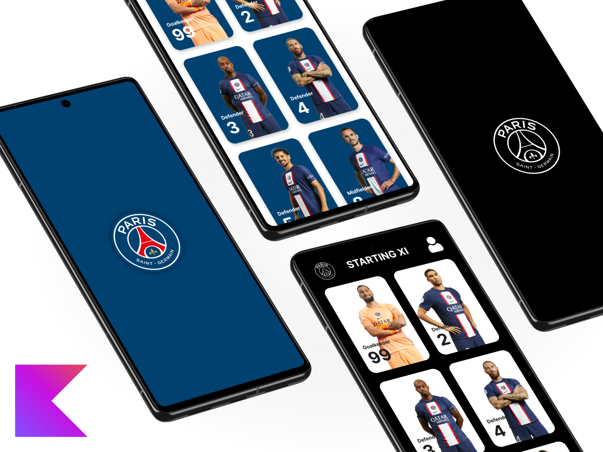

# 
<b>MyPSG</b>

## 
Bangkit 2023 - Mobile Development Learning Path

#### 
Final Submission for <b>Android For Beginner</b> course

***

> Figma UI design can be accessed from [here](https://www.figma.com/file/NYzZctNron6krnqVVHnePK/MyPSG).

Please keep in note to use this wisely and for reference only.

***

<i>This repository is only for educational purpose, as I will only use this for my Bangkit's assignments.</i>
